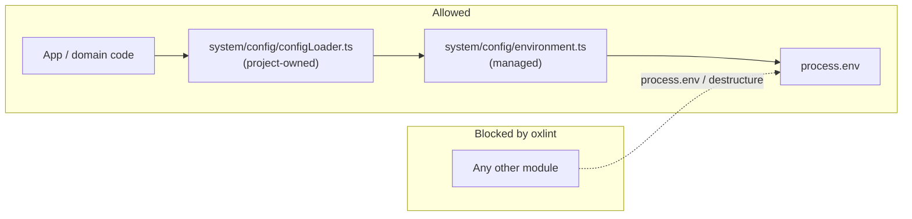

# Preset: `config`

Single gateway for environment variables. Application code never reads `process.env` directly; it goes through managed helpers in `system/config/environment.ts`.

## What it installs

| Kind         | Detail                                                                                                                                                          |
| ------------ | --------------------------------------------------------------------------------------------------------------------------------------------------------------- |
| Managed file | `system/config/environment.ts` ← `payload/system/config/environment.ts`                                                                                         |
| Dependency   | `valibot` (typed config/env schemas in project `configLoader` and elsewhere)                                                                                    |
| Oxlint rules | `config/environment-boundaries`, `config/no-valibot-custom`, `config/no-trivial-valibot-schema-alias` ← `oxlint/index.ts` (bundled to `.js` on package/install) |

Requires: none.

## How access flows



Verify checks `environment.ts` against the preset `contentHash` and refreshes the example under `.aqg/config/…`. Copy the example into place when the file is missing or drifted. Keep project-specific typed getters in your own `configLoader.ts` (or equivalent) that call the shared helpers (`getRequiredEnv`, `getBooleanEnv`, …).

## Boundary rule

Outside `system/config/environment.ts`, these patterns fail lint:

- `process.env…`
- `const { env } = process` / assignment destructuring of `process.env`

## Valibot rules

With this preset, oxlint also rejects:

- `v.custom(...)` and `import { custom } from 'valibot'`
- exported trivial schema aliases such as `export const StringArraySchema = v.array(v.string())`

Prefer structural schemas (`object`, `union`, `lazy`, `pipe` + `check`) and inline trivial builders at the use site. `export const NonEmpty = v.pipe(v.string(), v.minLength(1))` is allowed. For Bun file parse + valibot (no handmade JSON ADTs), enable the `bun-parse` preset.

## Enable

```yaml
presets:
  - config
```
