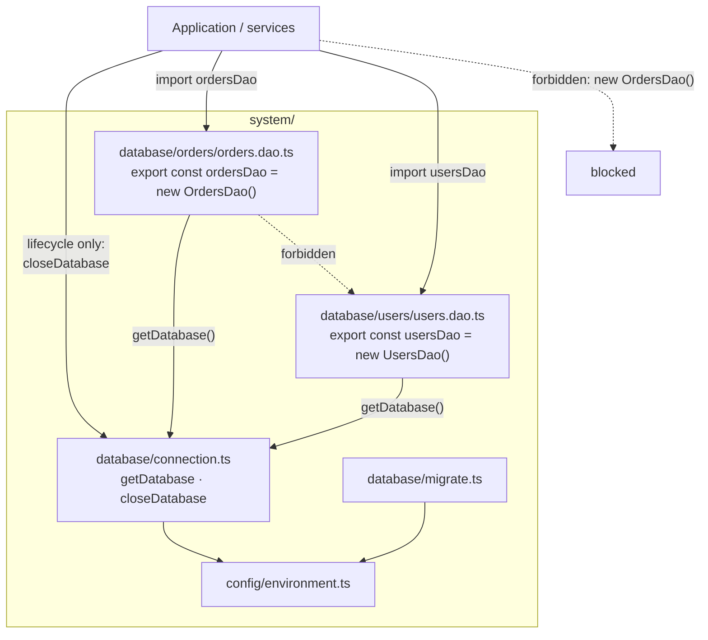
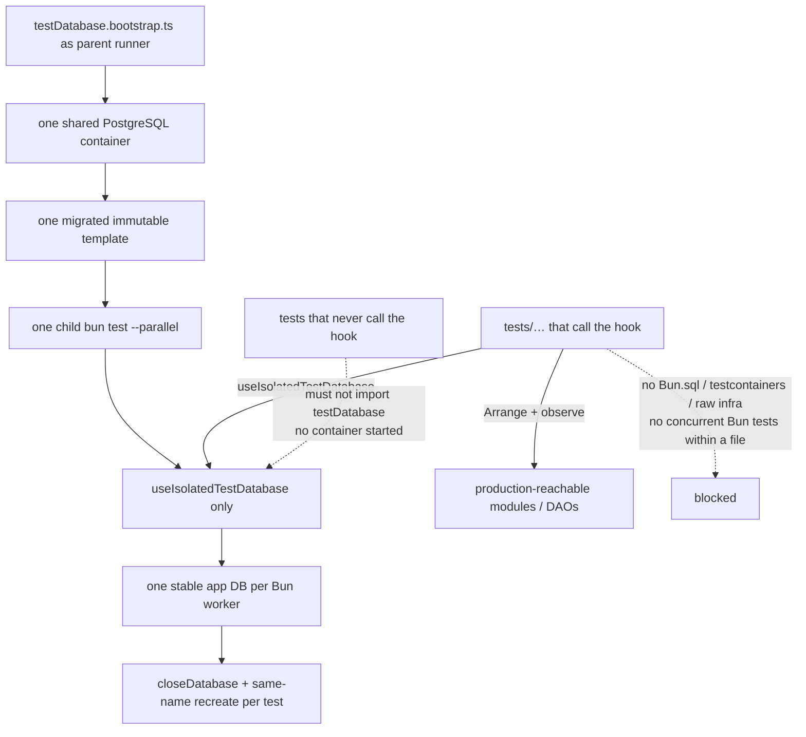

# Preset: `database`

PostgreSQL connection, migrations, and a managed per-test database hook, plus oxlint rules that keep SQL and driver access inside DAO modules and close test-infrastructure escape hatches.

## What it installs

| Kind          | Detail                                                                                                                                                                                               |
| ------------- | ---------------------------------------------------------------------------------------------------------------------------------------------------------------------------------------------------- |
| Managed files | `system/database/connection.ts`, `migrate.ts`, `migrate.types.ts`, `tests/setup/testDatabase.ts`, `tests/setup/testDatabase.bootstrap.ts`, `tests/setup/fixtures/terminate-database-connections.sql` |
| Runtime deps  | none (`Bun.sql` for queries and sequential `.sql` migrations)                                                                                                                                        |
| Dev deps      | `@testcontainers/postgresql`, `testcontainers`                                                                                                                                                       |
| package.json  | `ignoreScripts`: `ssh2`, `cpu-features`                                                                                                                                                              |
| Oxlint rules  | `database/dao-boundaries`, `database/test-database-boundaries` ← `oxlint/dao-boundaries.ts` (bundled to `.js` on package/install)                                                                    |

Requires: `config` (pulled in automatically).

## Production layout



DAO files live at `system/database/<domain>/<name>.dao.ts` (exactly one domain segment). They call `getDatabase()` inside each operation to obtain the active `Bun.SQL` client. Other modules may import only `closeDatabase` from `connection`, not the query surface. DAO implementations must not import each other.

When a production DAO exports a class named `*Dao`, it must also export one module singleton: `export const ordersDao = new OrdersDao()`. Construction is allowed only in that export. Call sites import the singleton; `new OrdersDao()` elsewhere (including tests) is rejected. Functional DAO modules without a `*Dao` class are unchanged.

`migrations/**/*.sql` is applied in lexicographic order by the managed Bun.sql runner (one transaction per file). If `pgmigrations` already exists, that ledger is reused; otherwise the runner creates `schema_migrations` in the same node-pg-migrate shape (`id`, `name`, `run_on`). Obvious `CREATE` / `ALTER` / `DROP` outside that tree is rejected, except managed `CREATE TABLE IF NOT EXISTS schema_migrations` inside `system/database/migrate.ts` and managed `CREATE DATABASE` / `DROP DATABASE` inside `tests/setup/testDatabase.ts` and `tests/setup/testDatabase.bootstrap.ts`. Files already present in git HEAD under `migrations/` must stay identical to HEAD. Verify restores those files and writes the discarded diff to `.aqg/restored-migration.diff`. The agent-facing hint points at that file; it does not list restored paths as violations. New files that are not in HEAD may still change.

## Test layout



Run database-enabled suites through the parent runner so one process owns the container:

```bash
bun tests/setup/testDatabase.bootstrap.ts bun test --parallel --timeout 120000 tests/*.integration.test.ts
```

The parent starts exactly one PostgreSQL Testcontainers container, migrates a bootstrap database, snapshots an immutable template, spawns one child `bun test` process with shared server connection metadata, forwards termination signals, returns the child exit status, and stops the container after success, failure, or interruption. Workers never start or stop the shared container.

`getDatabase()` constructs a replaceable lazy client on first use, so static DAO imports are valid before `DATABASE_URL` exists. Suites that need a database call `useIsolatedTestDatabase(testId)`; each Bun worker creates one stable application database named from `BUN_TEST_WORKER_ID` by cloning the parent template. Suites that never call the hook do not set `DATABASE_URL` or touch the server, even when `testDatabase.bootstrap` is imported. The container registers Testcontainers auto-cleanup (Ryuk) so a killed parent does not leave orphans; only the parent entrypoint stops the container.

Before every template restore, the hook closes the production SQL pool with `closeDatabase()` so the next `getDatabase()` call opens a fresh client against the recreated database. Tests never receive a connection URL.

Arrange and observe only through modules that are already production-reachable. Do not create or expand a DAO solely for a test. When no production path exists, stop and report the missing path as a blocker. Independent production read-after-write is the canonical persistence assertion.

Fresh database state belongs in the test body or a user `beforeEach` registered after `useIsolatedTestDatabase`. Database calls from a user `beforeAll` are invalid under the managed hook (the hook itself bootstraps in `beforeAll`). Concurrent Bun tests (`test.concurrent` / `it.concurrent` / `describe.concurrent`, including aliases) and `bun test --concurrent` package scripts are rejected while the process-wide app client remains. File-level `bun test --parallel` is supported because each file runs in an isolated worker with a distinct stable database; do not run concurrent tests inside a single database file.

## Enable

```yaml
presets:
  - database
```

`config` is activated transitively via `manifest.json` `requires`.
