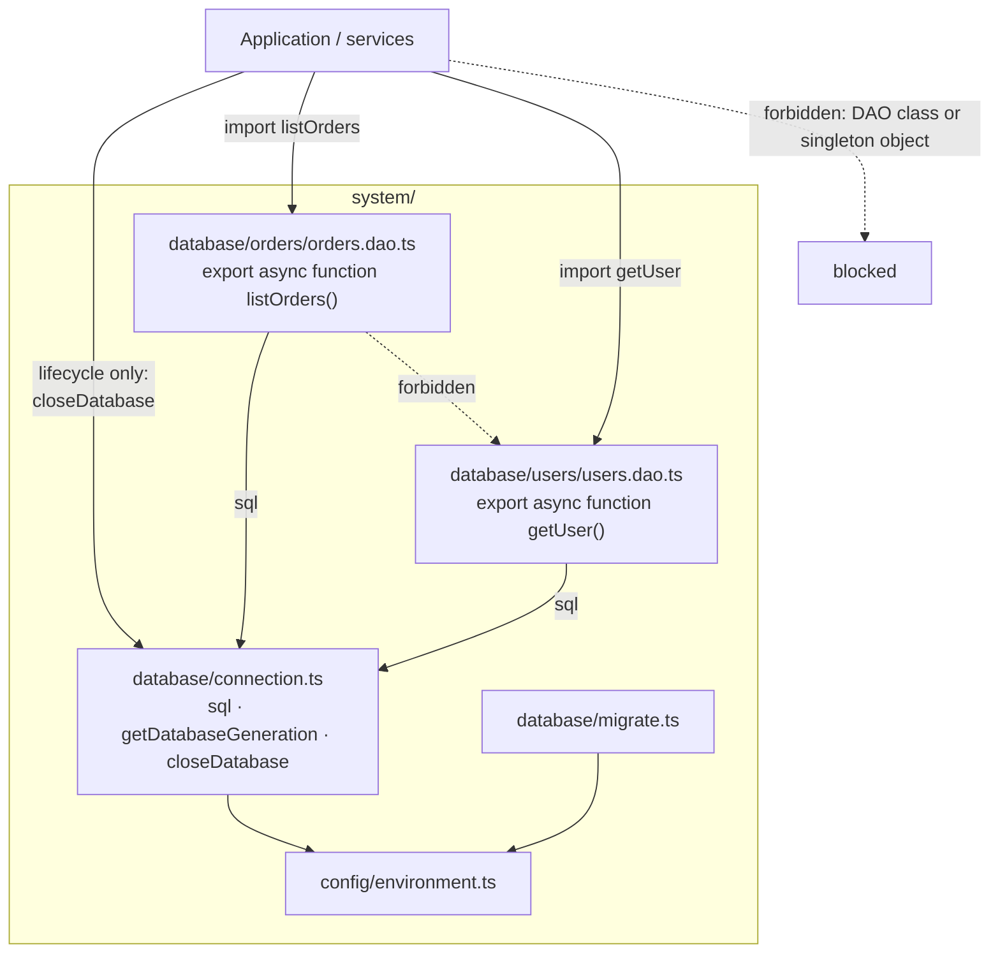
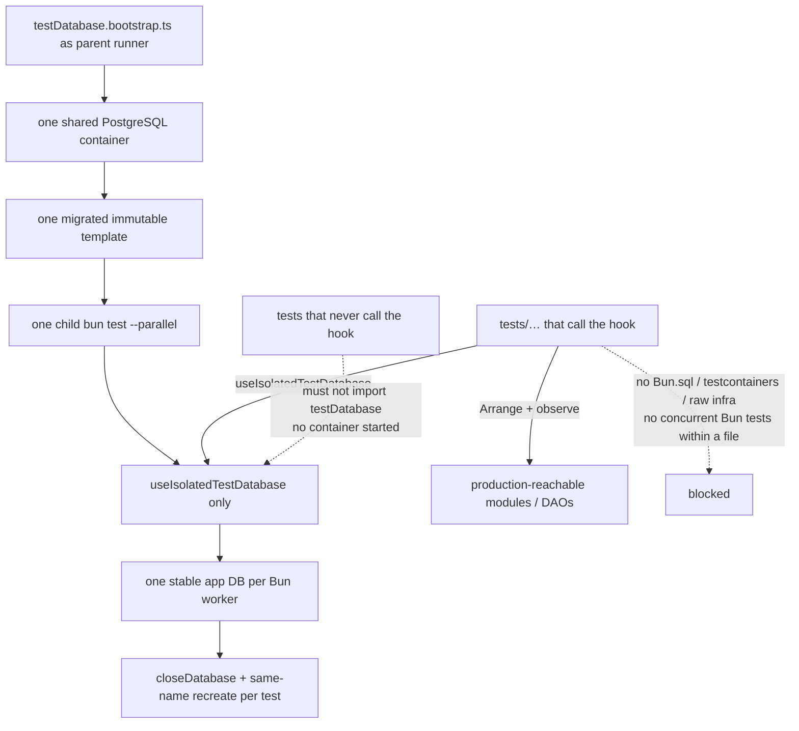

# Preset: `database`

PostgreSQL connection, migrations, and a managed per-test database hook, plus oxlint rules that keep SQL and driver access inside DAO modules and close test-infrastructure escape hatches.

## What it installs

| Kind          | Detail                                                                                                                                                                                                     |
| ------------- | ---------------------------------------------------------------------------------------------------------------------------------------------------------------------------------------------------------- |
| Managed files | `system/database/connection.ts`, `migrate.ts`, `tests/setup/testDatabase.ts`, `tests/setup/testDatabase.bootstrap.ts`, `tests/setup/fixtures/terminate-database-connections.sql`                           |
| Examples      | `.aqg/database/database-examples.md` + `.aqg/database/scripts/sync-database-managed.ts` (`exampleOnly`) — `database-examples.md` assembled from gated `examples/` sources via `bun ./build-examples-md.ts` |
| Runtime deps  | none (`Bun.sql` for queries and sequential `.sql` migrations)                                                                                                                                              |
| Dev deps      | `@testcontainers/postgresql`, `testcontainers`                                                                                                                                                             |
| package.json  | `ignoreScripts`: `ssh2`, `cpu-features`                                                                                                                                                                    |
| Oxlint rules  | `database/dao-boundaries`, `database/test-database-boundaries` ← `oxlint/dao-boundaries.ts` (bundled to `.js` on package/install)                                                                          |

Requires: `config` (pulled in automatically).

## Production layout



DAO files live at `system/database/<domain>/<name>.dao.ts` (exactly one domain segment). They import the stable lazy `sql` query surface from `connection`; do not wrap it or resolve a client inside each operation. After verify, follow `.aqg/database/database-examples.md` (DAO + shared cache + integration test). Shared in-process caches that must drop on pool recycle live in `system/database/caches.ts` and use `getDatabaseGeneration()` — never a `client.ts` / `createDatabaseAccessor` wrapper around `sql`. Other modules may import only `closeDatabase` from `connection`, except database-owned cache infrastructure under `system/database/` may use `getDatabaseGeneration()`. DAO implementations must not import each other.

DAO implementations are functional modules. Their runtime surface consists only of directly exported named function declarations such as `listOrders` and `saveOrder`; type exports remain allowed. Classes, `new *Dao()`, default exports, exported variables, runtime re-exports, and object bags are rejected. Consumers invoke imported DAO operations directly; they must not store, alias, pass, return, re-export, or aggregate those operations as runtime values. Exported object facades backed by local DAO wrappers are rejected as well. Test files may pass a DAO namespace to Bun's `spyOn` only to replace a named operation. Keep SQL composition helpers private or pass the current transaction to a non-DAO helper. These constraints keep each operation visible to production dead-code analysis instead of laundering test-only methods through a reachable object export.

Keep result handling at the query site. Optional reads return `rows[0] ?? null`; mapped optional reads inspect `rows[0]` and map it only when present. An `UPDATE` or `DELETE` that must distinguish not-found adds `RETURNING` for a stable key and checks `rows.length === 0`. Do not create `dao-result.ts` / `map-first-row.ts` micro-modules or type Bun SQL mutations as `{ count: number }`.

Build dynamic filtering and sorting with tagged SQL fragments. Bun SQL `.unsafe()` is rejected outside the managed migration runner and managed test-database infrastructure.

Define empty-list semantics in the DAO before passing a dynamic value list to `sql(values)` / `tx(values)`. Return an empty result or no-op when an empty list means match-none; omit the conditional SQL fragment when it means no filter. Cover the empty case through the production DAO against the isolated PostgreSQL database.

`migrations/**/*.sql` is applied in lexicographic order by the managed Bun.sql runner (one transaction per file). Invoke the runner with `bun system/database/migrate.ts` (`import.meta.main`); keep types and CLI in that file. If `pgmigrations` already exists, that ledger is reused; otherwise the runner creates `schema_migrations` in the same node-pg-migrate shape (`id`, `name`, `run_on`). Obvious `CREATE` / `ALTER` / `DROP` outside that tree is rejected, except managed `CREATE TABLE IF NOT EXISTS schema_migrations` inside `system/database/migrate.ts` and managed `CREATE DATABASE` / `DROP DATABASE` inside `tests/setup/testDatabase.ts` and `tests/setup/testDatabase.bootstrap.ts`. Files already present in git HEAD under `migrations/` must stay identical to HEAD. Verify restores those files and writes the discarded diff to `.aqg/restored-migration.diff`. The agent-facing hint points at that file; it does not list restored paths as violations. New files that are not in HEAD may still change.

## Test layout



Run database-enabled suites through the parent runner so one process owns the container:

```bash
bun tests/setup/testDatabase.bootstrap.ts bun test --parallel --timeout 120000 tests/*.integration.test.ts
```

The parent starts exactly one PostgreSQL Testcontainers container, migrates a bootstrap database, snapshots an immutable template, spawns one child `bun test` process with shared server connection metadata, forwards termination signals, returns the child exit status, and stops the container after success, failure, or interruption. Workers never start or stop the shared container.

`sql` resolves a replaceable lazy client on first query or property access, so static DAO imports are valid before `DATABASE_URL` exists. Tagged queries, query fragments such as `sql(ids)`, and transactions all resolve through the same query surface. Suites that need a database call `useIsolatedTestDatabase(testId)`; each Bun worker creates one stable application database named from `BUN_TEST_WORKER_ID` by cloning the parent template. Suites that never call the hook do not set `DATABASE_URL` or touch the server, even when `testDatabase.bootstrap` is imported. The container registers Testcontainers auto-cleanup (Ryuk) so a killed parent does not leave orphans; only the parent entrypoint stops the container.

Before every template restore, the hook closes the production SQL pool with `closeDatabase()` so the next `sql` operation opens a fresh client against the recreated database. `getDatabaseGeneration()` changes whenever the active client is created, replaced, or closed, allowing database-owned caches to reject values from an earlier client without adding accessors to DAOs. Tests never receive a connection URL.

Arrange and observe only through modules that are already production-reachable. Do not create or expand a DAO solely for a test. When no production path exists, stop and report the missing path as a blocker. Independent production read-after-write is the canonical persistence assertion.

Fresh database state belongs in the test body or a user `beforeEach` registered after `useIsolatedTestDatabase`. Database calls from a user `beforeAll` are invalid under the managed hook (the hook itself bootstraps in `beforeAll`). Concurrent Bun tests (`test.concurrent` / `it.concurrent` / `describe.concurrent`, including aliases) and `bun test --concurrent` package scripts are rejected while the process-wide app client remains. File-level `bun test --parallel` is supported because each file runs in an isolated worker with a distinct stable database; do not run concurrent tests inside a single database file.

## Sync managed files

Do not invent copy paths. After `verify` refreshes `.aqg/<preset>/<destination>` examples, run the deterministic helper that lives in `.aqg`:

```bash
bun .aqg/database/scripts/sync-database-managed.ts
# or with explicit root
bun .aqg/database/scripts/sync-database-managed.ts /path/to/project
```

It copies every managed `config` + `database` file from `.aqg` to its project destination (`system/config/environment.ts`, `system/database/*`, `tests/setup/*`), overwriting those destinations in place. Rerun `verify` afterwards.

## Enable

```yaml
presets:
  - database
```

`config` is activated transitively via `manifest.json` `requires`.
